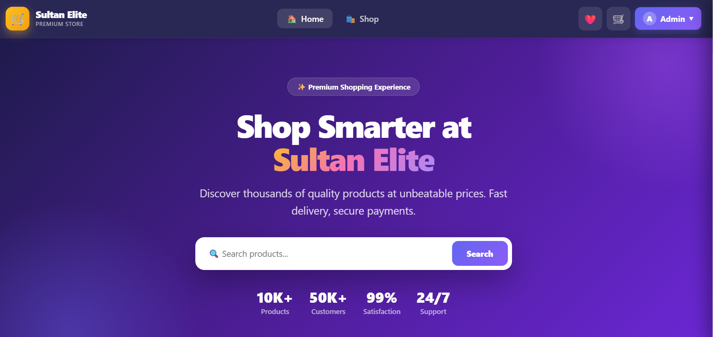
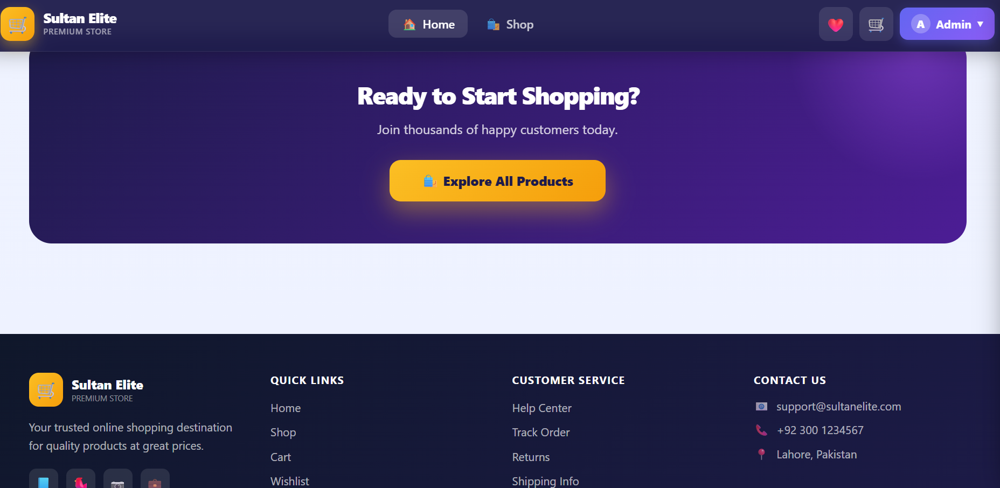

<div align="center">

# 🛒 MERN E-Commerce Platform — Sultan Elite

### A complete, full-stack online shopping platform built with the MERN stack

[](https://reactjs.org/)
[](https://nodejs.org/)
[](https://expressjs.com/)
[](https://www.mongodb.com/)
[](LICENSE)

[🚀 Live Demo](https://mern-ecommerce-platform-fui5.vercel.app/) · [🐛 Report Bug](https://github.com/muhammadhasnain3031/MERN-Ecommerce-Platform/issues) · [✨ Request Feature](https://github.com/muhammadhasnain3031/MERN-Ecommerce-Platform/issues)

</div>

---

## 📖 About The Project

**Sultan Elite** is a fully functional e-commerce web application built from scratch using the **MERN stack** (MongoDB, Express.js, React.js, Node.js). It features a complete shopping experience for customers and a powerful admin dashboard for store management — all wrapped in a modern, fully responsive UI.

This project was built as a deep dive into full-stack development, covering everything from authentication and state management to image uploads and order processing.

---

## ✨ Features

### 🛍️ Customer Features
- **Product Browsing** — Browse products with images, ratings, and details
- **Search & Filters** — Search by name, filter by category and price range
- **Sorting** — Sort by newest, price, or top-rated
- **Shopping Cart** — Add, remove, and update quantities with live total
- **Wishlist** — Save favorite items for later ❤️
- **User Authentication** — Secure register/login with JWT
- **Order System** — Place orders and track order history
- **Product Details** — Image gallery, related products, reviews
- **Responsive Design** — Works seamlessly on mobile, tablet & desktop 📱

### ⚙️ Admin Features
- **Dashboard** — Overview with product stats
- **Product Management** — Add, edit, and delete products
- **Image Upload** — Cloudinary integration for product images
- **Order Management** — View and update order status
- **Inventory Tracking** — Stock and low-stock indicators

### 🎨 UI/UX
- Smooth animations & transitions
- Toast notifications
- Loading skeleton screens
- Premium gradient design

---

## 🛠️ Tech Stack

| Category | Technologies |
|----------|-------------|
| **Frontend** | React 19, Redux Toolkit, React Router v7 |
| **Backend** | Node.js, Express.js |
| **Database** | MongoDB (Mongoose ODM) |
| **Authentication** | JWT (JSON Web Tokens), bcrypt |
| **Image Storage** | Cloudinary |
| **File Upload** | Multer |
| **Styling** | Custom CSS3 with animations |
| **Deployment** | Vercel |

---

## 📁 Project Structure

```
MERN-Ecommerce-Platform/
├── backend/
│   ├── middleware/      # Auth & upload middleware
│   ├── models/          # User, Product, Order schemas
│   ├── routes/          # API routes (auth, products, orders, cart)
│   ├── server.js        # Express server entry
│   └── seedProducts.js  # Demo data seeder
│
└── frontend/
    └── src/
        ├── components/  # Navbar, Footer, ProductCard, Toast
        ├── pages/       # Home, Shop, Cart, Admin, Login, etc.
        ├── store/       # Redux slices (auth, cart, wishlist)
        └── services/    # API configuration
```

---

## 🚀 Getting Started

### Prerequisites
- Node.js (v20 or higher)
- MongoDB Atlas account
- Cloudinary account

### Installation

**1. Clone the repository**
```bash
git clone https://github.com/muhammadhasnain3031/MERN-Ecommerce-Platform.git
cd MERN-Ecommerce-Platform
```

**2. Setup Backend**
```bash
cd backend
npm install
```

Create a `.env` file in the `backend` folder:
```env
MONGO_URI=your_mongodb_connection_string
JWT_SECRET=your_jwt_secret_key
CLOUDINARY_CLOUD_NAME=your_cloud_name
CLOUDINARY_API_KEY=your_api_key
CLOUDINARY_API_SECRET=your_api_secret
PORT=5000
```

Start the backend:
```bash
node server.js
```

**3. Setup Frontend**
```bash
cd frontend
npm install
npm start
```

**4. Seed demo products (optional)**
```bash
cd backend
node seedProducts.js --fresh
```

**5. Create admin user**
```bash
node createAdmin.js
```
Default admin → Email: `admin@store.com` · Password: `admin123`

---

## 🔌 API Endpoints

| Method | Endpoint | Description |
|--------|----------|-------------|
| `POST` | `/api/auth/register` | Register a new user |
| `POST` | `/api/auth/login` | Login user |
| `GET` | `/api/products` | Get all products (with filters) |
| `GET` | `/api/products/:id` | Get single product |
| `POST` | `/api/products` | Create product (admin) |
| `PUT` | `/api/products/:id` | Update product (admin) |
| `DELETE` | `/api/products/:id` | Delete product (admin) |
| `POST` | `/api/orders` | Place an order |
| `GET` | `/api/orders/myorders` | Get user's orders |

---

## 📸 Screenshots



---

## 🗺️ Roadmap

- [ ] Payment gateway integration (Stripe / JazzCash)
- [ ] Product reviews & ratings system
- [ ] Email notifications for orders
- [ ] Advanced analytics dashboard
- [ ] Multi-language support

---

## 🤝 Contributing

Contributions are welcome! Feel free to open an issue or submit a pull request.

1. Fork the project
2. Create your feature branch (`git checkout -b feature/AmazingFeature`)
3. Commit your changes (`git commit -m 'Add AmazingFeature'`)
4. Push to the branch (`git push origin feature/AmazingFeature`)
5. Open a Pull Request

---

## 📝 License

Distributed under the MIT License. See `LICENSE` for more information.

---

## 👨‍💻 Author

**Muhammad Hasnain**

- GitHub: [@muhammadhasnain3031](https://github.com/muhammadhasnain3031)
- Live Demo: [Sultan Elite Shop](https://mern-ecommerce-platform-fui5.vercel.app/)

---

<div align="center">

### ⭐ If you found this project helpful, please give it a star!

Made with ❤️ using the MERN Stack

</div>